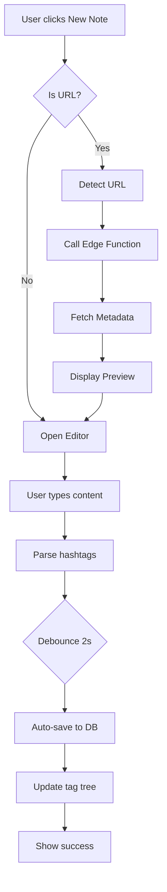
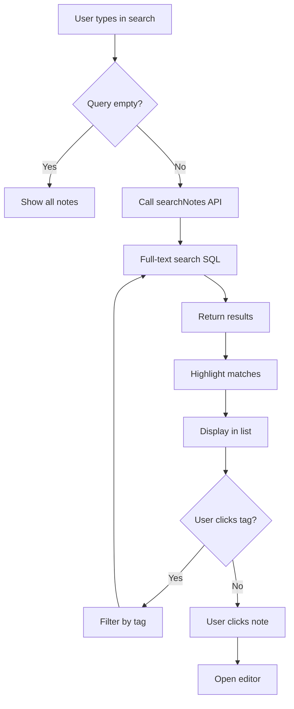

# SPEC: Tủ Lạnh (MarkNote) Module - Technical Specification

**Version:** 1.0  
**Date:** 2026-01-30  
**Status:** Planning Complete  
**Author:** AI Architect

---

## 1. EXECUTIVE SUMMARY

**Tủ Lạnh** là một module ghi chú tối giản được tích hợp vào Builder Ecosystem, cho phép users lưu trữ và tìm kiếm ghi chú Markdown và URL bookmarks với hệ thống hashtag phân cấp.

### Core Value Proposition:
> "Lưu & tìm ghi chú/URL đơn giản với Markdown + hashtag phân cấp - ngay trong Builder Ecosystem"

### Integration Strategy:
- ✅ **Kế thừa 80% infrastructure** (Next.js, Supabase, Auth, UI components)
- ✅ **Thêm 3 tables mới**: notes, tags, note_tags
- ✅ **Route: `/notes`**
- ✅ **Estimated Time:** 12-15 working days

---

## 2. USER STORIES

### US-01: Create Note
**As a** logged-in user  
**I want to** create a new Markdown note  
**So that** I can save my ideas quickly

**Acceptance Criteria:**
- [ ] Click "New Note" button
- [ ] Enter title and Markdown content
- [ ] Auto-save after 2s of inactivity
- [ ] Display success message
- [ ] Note appears in list immediately

### US-02: Create URL Bookmark
**As a** logged-in user  
**I want to** paste a URL and have metadata auto-fetched  
**So that** I can bookmark articles without manual entry

**Acceptance Criteria:**
- [ ] Paste URL in content
- [ ] System detects URL automatically
- [ ] Fetch title + description (< 5s)
- [ ] Display as card preview
- [ ] Save as `is_url=true` note

### US-03: Add Hashtags
**As a** user  
**I want to** add hierarchical hashtags to notes  
**So that** I can organize them by categories

**Acceptance Criteria:**
- [ ] Type `#` to trigger autocomplete
- [ ] Support hierarchy: `#work/project-a/task-1`
- [ ] Multiple tags per note
- [ ] Display in tag tree sidebar

### US-04: Search Notes
**As a** user  
**I want to** search notes by title, content, or hashtag  
**So that** I can find information quickly

**Acceptance Criteria:**
- [ ] Full-text search (< 1s response)
- [ ] Highlight search terms
- [ ] Filter by tag (click tag in sidebar)
- [ ] Sort results by relevance

### US-05: Edit & Delete Notes
**As a** user  
**I want to** edit or delete my notes  
**So that** I can keep information up-to-date

**Acceptance Criteria:**
- [ ] Click note to open editor
- [ ] Changes auto-save
- [ ] Delete with confirmation dialog
- [ ] Soft-delete (7-day retention optional for Phase 2)

---

## 3. DATABASE DESIGN

### ERD (Entity Relationship Diagram)

```
┌─────────────┐
│ auth.users  │
│ (Existing)  │
└──────┬──────┘
       │ 1
       │
       │ *
┌──────▼──────────┐
│     notes       │
├─────────────────┤
│ id (PK)         │
│ user_id (FK)    │
│ title           │
│ content         │
│ is_url          │
│ url             │
│ url_title       │
│ url_description │
│ created_at      │
│ updated_at      │
└────────┬────────┘
         │ *
         │
         │ *
    ┌────▼────────┐
    │  note_tags  │ (junction)
    ├─────────────┤
    │ note_id (FK)│
    │ tag_id (FK) │
    └────┬────────┘
         │ *
         │
         │ *
┌────────▼────────┐
│      tags       │
├─────────────────┤
│ id (PK)         │
│ user_id (FK)    │
│ name            │
│ slug            │
│ parent_id (FK)  │◄─┐
│ level           │  │
│ created_at      │  │
└─────────────────┘  │
         ▲            │
         └────────────┘ (self-reference)
```

### SQL Schema (Complete)

See: `plans/260130-1107-tulalanh/phase-01-database-schema.md`

---

## 4. LOGIC FLOWCHART

### Flow 1: Create Note



### Flow 2: Search Notes



---

## 5. API CONTRACT

### Server Actions (Next.js)

#### 5.1 Notes Actions

**File:** `src/app/actions/notes.ts`

```typescript
// Create note
export async function createNote(data: {
  title: string;
  content: string;
  is_url?: boolean;
  url?: string;
}): Promise<Note>;

// Update note
export async function updateNote(
  id: string,
  data: Partial<Note>
): Promise<Note>;

// Delete note
export async function deleteNote(id: string): Promise<void>;

// Get notes (with pagination)
export async function getNotes(params: {
  userId: string;
  limit?: number;
  offset?: number;
  tagId?: string;
}): Promise<Note[]>;

// Search notes
export async function searchNotes(params: {
  userId: string;
  query: string;
}): Promise<Note[]>;
```

#### 5.2 Tags Actions

**File:** `src/app/actions/tags.ts`

```typescript
// Get all tags for user
export async function getTags(userId: string): Promise<Tag[]>;

// Get tag tree (hierarchical)
export async function getTagTree(userId: string): Promise<TagNode[]>;

// Create tag
export async function createTag(data: {
  userId: string;
  name: string; // Full path: work/project-a
  parentId?: string;
}): Promise<Tag>;
```

#### 5.3 Edge Function (Supabase)

**URL:** `https://PROJECT_REF.supabase.co/functions/v1/fetch-url-metadata`

**Request:**
```json
POST /functions/v1/fetch-url-metadata
Authorization: Bearer <anon_key>

{
  "url": "https://react.dev"
}
```

**Response:**
```json
{
  "title": "React",
  "description": "The library for web and native user interfaces"
}
```

**Error Response:**
```json
{
  "error": "Failed to fetch URL"
}
```

---

## 6. UI COMPONENTS

### Component Tree

```
App (Builder Ecosystem)
└── Layout
    └── Sidebar
        └── 📦 Tủ Lạnh (new menu item)
    └── Main Content
        └── /notes Route
            ├── NoteSearch
            ├── TagTree (Sidebar Right)
            └── NoteList
                ├── NoteCard (multiple)
                │   ├── NoteMeta (date, tags)
                │   └── NotePreview
                └── NoteEditor (when clicked)
                    ├── TitleInput
                    ├── MarkdownEditor
                    ├── MarkdownPreview
                    └── TagAutocomplete
```

### Component Specs

#### `NoteList.tsx`
```typescript
interface NoteListProps {
  notes: Note[];
  onNoteClick: (id: string) => void;
  onNoteDelete: (id: string) => void;
}
```

#### `NoteEditor.tsx`
```typescript
interface NoteEditorProps {
  noteId?: string; // undefined for new note
  onSave: (data: Partial<Note>) => void;
  onCancel: () => void;
}
```

#### `TagTree.tsx`
```typescript
interface TagTreeProps {
  tags: TagNode[];
  onTagClick: (tagId: string) => void;
  selectedTagId?: string;
}

interface TagNode {
  id: string;
  name: string;
  slug: string;
  count: number; // số notes trong tag
  children: TagNode[];
}
```

---

## 7. HIDDEN REQUIREMENTS

### 7.1 Auto-save Mechanism
- **Debounce:** 2 seconds after last keystroke
- **Conflict Resolution:** Last write wins (no CRDT for MVP)
- **Offline:** Not supported in MVP (Phase 2)

### 7.2 URL Metadata Caching
-Fetch once per URL
- Cache in `url_fetched_at` timestamp
- Re-fetch if > 30 days old (Phase 2)

### 7.3 Tag Hierarchy Rules
- **Max depth:** 5 levels
- **Naming:** alphanumeric + dash, no spaces
- **Delimiter:** `/` (slash)
- **Example:** `work/project-a/backend/api/auth`

### 7.4 Search Behavior
- **Minimum query length:** 2 characters
- **Max results:** 100 per page
- **Ranking:** PostgreSQL full-text search ranking
- **Fuzzy search:** Not in MVP (Phase 2)

### 7.5 Performance Requirements
- **Note list load:** < 500ms (100 notes)
- **Search:** < 1s (1000 notes)
- **Auto-save:** < 200ms
- **Tag tree:** < 300ms

---

## 8. TECH STACK DETAIL

### Frontend Stack:
```json
{
  "framework": "Next.js 16.1.3",
  "language": "TypeScript 5.x",
  "ui-components": "Shadcn/UI (Radix)",
  "styling": "TailwindCSS 3.4.19",
  "markdown": "react-markdown ^9.0.0",
  "markdown-plugins": "remark-gfm ^4.0.0"
}
```

### Backend Stack:
```json
{
  "database": "Supabase PostgreSQL 15",
  "auth": "Supabase Auth",
  "functions": "Supabase Edge Functions (Deno)",
  "storage": "N/A (text only in MVP)"
}
```

### No New Dependencies Required! ✅

---

## 9. BUILD CHECKLIST

### Phase 01: Database ✅
- [ ] Create migration SQL
- [ ] Run on Supabase
- [ ] Verify tables
- [ ] Test RLS policies

### Phase 02: Edge Function
- [ ] Create function
 - [ ] Deploy to Supabase
- [ ] Test URL fetching
- [ ] Handle errors

### Phase 03: Backend
- [ ] Create Server Actions
- [ ] Define TypeScript types
- [ ] Test CRUD operations

### Phase 04: Core UI
- [ ] Create routes
- [ ] Build NoteList
- [ ] Build NoteEditor
- [ ] Implement auto-save

### Phase 05: Hashtags
- [ ] Parse hashtags
- [ ] Build TagTree
- [ ] Tag autocomplete
- [ ] Filter by tag

### Phase 06: Search
- [ ] Search component
- [ ] Full-text SQL
- [ ] Highlight results

### Phase 07: Integration
- [ ] Add to Sidebar
- [ ] Setup routing
- [ ] Mobile responsive
- [ ] E2E testing

### Final Polish:
- [ ] Dark mode verify
- [ ] Accessibility check
- [ ] Performance audit
- [ ] User acceptance testing

---

## 10. DEPLOYMENT NOTES

### Dev Environment:
```bash
npm run dev
# App at http://localhost:3000
# Notes at http://localhost:3000/notes
```

### Production Deployment:
- Same VPS as Builder Ecosystem
- No separate deployment needed
- PM2 restart after deploy

---

## 📊 METRICS & SUCCESS CRITERIA

### MVP Success:
- [ ] User có thể tạo 10+ notes/day
- [ ] Search < 1s
- [ ] Auto-save 100% reliable
- [ ] Tag tree correct
- [ ] URL fetch > 80% success rate
- [ ] Mobile responsive

### Post-Launch Metrics:
- Average notes/user
- Search usage %
- Tags created/user
- URL bookmark vs text note ratio

---

**Plan created:** 2026-01-30  
**Ready to implement:** Phase 01 - Database Schema  
**Next:** Create migration SQL file 🚀
